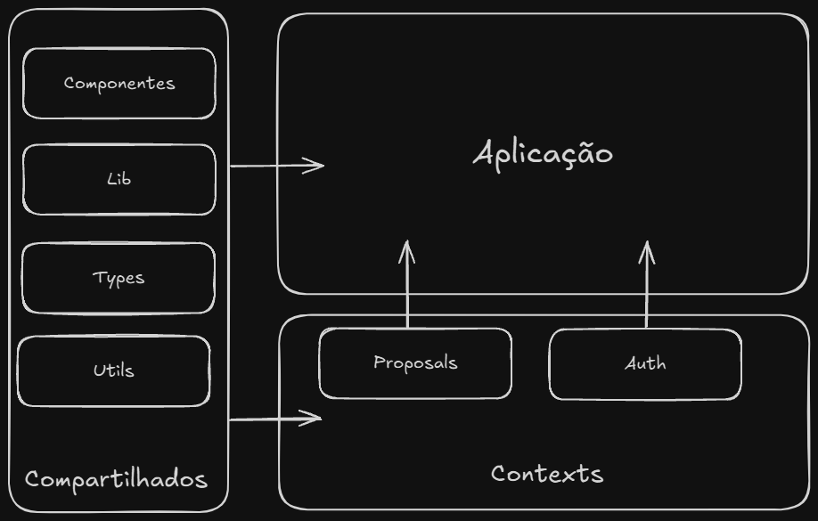

# 🗄️ Estrutura do Projeto

Este projeto segue a seguinte estrutura:

```bash
.
├── .vscode/
├── docs/
├── public/
├── src/
│   ├── app/
│   ├── components/
│   ├── contexts/
│   │   ├── auth/
│   │   └── proposals/
│   │       ├── components/
│   │       ├── model/
│   │       ├── data/
│   │       ├── services/
│   │       └── provider.tsx
│   ├── lib/
│   ├── types/
│   └── utils/
├── next.config.mjs
├── package.json
└── ...
```

Destrinchando a estrutura do projeto:

- `.vscode/`: Configurações do VSCode forçadas no projeto;
- `docs/`: As documentações do projeto (tipo essa que você esta lendo agora);
- `public/`: Pasta pública de imagens, SVGs e afins que devem ser enviados ao browser do cliente;
- `src/`: Base de código do projeto.
  - `app/`: App Router do NextJS, onde as páginas se localizam.;
  - `components/`: Componentes genéricos do aplicativo, usados no aplicação toda;
  - `contexts/`: Contextos responsáveis por armzenar todo o código referente às funcionalidades da aplicação;
  - `lib/`: Configuração de biblitoecas e utilitários externos;
  - `types/`: Tipagens da aplicação;
  - `utils/`: Utilitários genéricos do aplicativo, usados na aplicação toda;

**Observação:** Caso você possua alguma dúvida quanto a estrutura de pastas do aplicativo, não hesite em chamar algum dos responsáveis pelo código para sanar a dúvida.

## Entendendo a `contexts/`

A pasta `contexts/` é onde se localiza o código responsável por dar vida as funcionalidades presentes no Proposals, ela é organizada com pastas filhas que possuem um nome intuitivo sobre funcionalidade a qual ela é responsável.

Cada pasta filha segue a seguinte organização:

```bash
proposal/
├── components
├── model
├── data
├── services
└── provider.tsx
```

Explicando mais detalhadamente:

- `components/`: Componentes específicos da feature;
- `model/`: Replicação da tabela do banco e validações dos dados;
- `data/`: Validação de mensagens de erro e funções de CREATE, UPDATE e *mocks*;
- `services/`: Ações executadas no back-end/banco de dados.

Na imagem abaixo você pode ver uma representação visual de como funciona o fluxo de código deste projeto:

